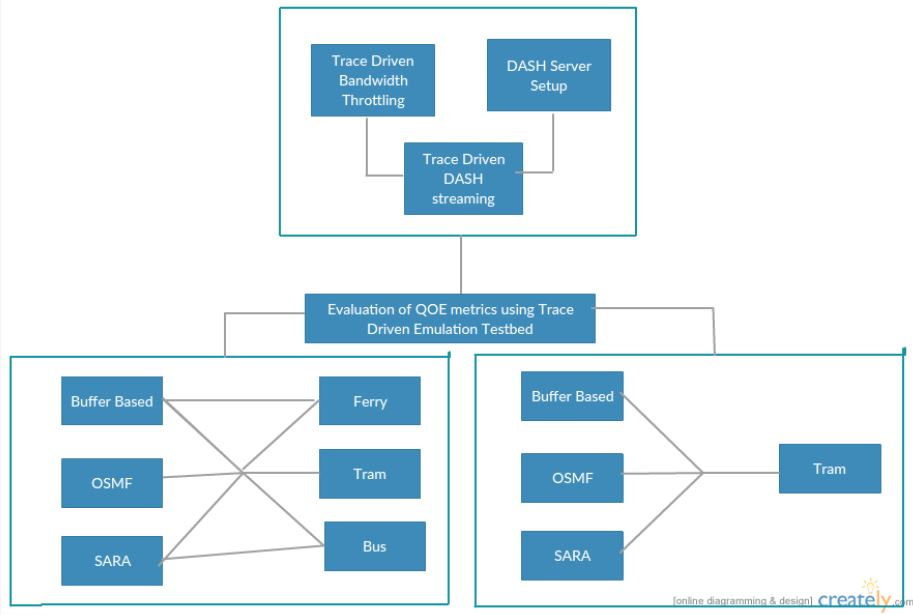

# Evaluation-of-QOE-through-Trace-Driven-Emulation

<b><h2>Introduction</b></h2>

                           Providing best user experience for video on demand services is possible by quantifying users’ experience using QOE metrics. Depending on the type of measurement, QOE metrics can be classified as <b>subjective</b> and <b>objective</b> metrics. Measurement of subjective QOE metrics is influenced by psychological factors of the user, and hence is biased and varies from one user to another, making it tedious and hard to measure.  Earlier research works measured <b>objective metrics</b> like <b>playback start time</b>, <b>number of interruptions</b>, <b>average bitrate</b>, etc. But neither did they conduct experiment in real time network conditions nor did they consider different bandwidths patterns(consisting of both long and short bandwidth variations). This work proposes a real time trace driven emulation testbed to evaluate objective QOE metrics.  The aim of this work is two fold: 
<ul>
   <li> to create an emulation testbed capable of replicating wide–range network conditions using real time bandwidth traces</li> 
   <li> to do an extensive analysis of different rate adaptation algorithms for dash by choosing noteworthy QOE metrics under different real-time trace driven network conditions.</li>
 </ul>
 

<b><h2>QOE Metrics</b></h2>
<ul>
  <li> Traditional QOS Metrics are not sufficient to quantify users’ experience. </li>
  <li> Based on measurement methodologies, QOE metrics are either subjective metrics or objective metrics. </li>
  <li> Playback start time, number of interruptions, quality of video file are some of objective metrics. </li>
  <li> Mean Opinion Score is an example of subjective metrics. Subjective metrics are affected by psychological and physical factors. </li>
  <li> Subjective QOE metrics are user-biased whereas objective QOE metrics can be automated. </li>
  <li> In this work, we consider number of <b>bitrate switching events</b>, <b>number of re-buffering events</b>, <b>startup delay</b>, <b>time taken to reach highest bitrate</b> and <b>average bitrate</b> perceived as objective QOE metrics for evaluation.</li>
</ul>

<b><h2>Throttling tool</b></h2>
<ul>
  <li> We used <b>Linux Traffic Control(TC)</b> as our throttling tool. </li>
  <li> TC uses Token Bucket Filter(TBF) to throttle bandwidth of the link. </li>
  <li> Traffic is filtered based on the expenditure of tokens. </li>
  <li> Tokens roughly correspond to bytes and tokens arrive at a steady rate until bucket is full. </li>
  <li> Of all other tools, we found TC convenient at the bandwidth range we are working. </li>
</ul>

 The comparision for different throttling tools across smaller bandwidths is captured below: 

<pre>                                 || </pre>

 The comparision for different throttling tools across smaller bandwidths is captured below: 

<pre>                                 || </pre>

<b><h2>Rate Adaption Algorithms</b></h2>
 <ul>
    <li> This work considers evaluation of objective QOE metrics for three rate adaptation algorithms: 
          <ul>
             <li> 
<b>Buffer Based approach: </b> the representation of the next segment is based on the present buffer occupancy. It makes sure there are no unnecessary re-buffering events and always achieves an average video-rate equal to available capacity in steady state 
</li>
             <li> 
 <b>OSMF:</b> the main aim is to maximize QOE of user, for this, intermediate levels are introduced instead of a direct change. It contains two parts one to measure available bandwidth by RTT variations and other to effectively choose video quality level based on estimated bandwidth. 
</li>
             <li> 
 <b>SARA:</b>  apart from present buffer occupancy and path bandwidth, variation in segment sizes is also considered to decide the representation of the next segment to be downloaded.
</li>
           </ul>
    </li>

<b><h2>Project Layout</b></h2>
<pre>                          || </pre>

<b><h2>Experimental Setup</b></h2>
<ul>
  <li> We considered HSDPA bandwidth logs for throttling our client-server link. We considered three different bandwidth trace logs, collected using different mode of transportation: bus, tram and ferry </li>
  <pre> |||| </pre>
  <li> For evaluating objective QOE metrics, we chose Big Buck Bunny 10 seconds as our DASH video dataset. It contains 60 segments, each segment is of 10 second duration and has a total of 20 representations. </li>
  <li> The emulation testbed is based on a client-server model, where in, the link is throttled at the server as per the bandwidth trace logs considered, and client is equipped with a player capable of streaming DASH content. </li>
  <li> Depending on the rate adaptation algorithm employed and the bandwidth of the link, the player queries the server for a particular representation of the new segment.</li>
  <li> We then evaluated objective QOE metrics for three rateadaptation algorithms mentioned above, in three varied bandwidth trace conditions. </li>
  <li> We also evaluated objective QOE metrics for shared bottleneck scenario, wherein multiple clients, each running different rate adaptation algorithm query a single server which is throttled as per the bandwidth trace logs considered. </li>
</ul>

<b><h2>Results</b></h2>
   <ul>
      <li>We evaluated bitrate switching events, number of re-buffering events, startup delay, time taken to reach highest bitrate and average bitrate perceived for a single client-server based throttling using three varied bandwidth traces.</li>
      <li>The below graphs show our results in a bar plot for each objective QoE metric for three different trace logs.</li>
      <li>We also evaluated objective QoE metrics for shared bottleneck scenarios too.</li>
      <li>The below graphs show our results in a bar plot for each objective QoE metric for a single trace log.</li>
      <li>The next few graphs depicts the segment representations of different algorithms for above considered scenarios.</li>
   </ul>
   
<b><h2>Conclusion</b></h2>
<ul>
  <li> The results are strongly affected by the variations in bandwidth traces used for throttling which can be seen in the graphs plotted.</li>
  <li> OSMF has more number of re-buffering events, owing to it’s design to maximize users’ QOE by including intermediary levels.</li>
  <li >Number of bitrate switching events were comparatively more for SARA, because it wants to minimize rebuffering events and also bandwidth traces also add up to this behavior.</li>
  <li> Startup delay is low for SARA, owing to it’s fast start phase, where it takes lowest representation possible</li>
  <li> For shared scenario, OSMF has highest average perceived bitrate owing to it’s design to maximize users’ QOE whenever possible. This also explains the reason for it to have more number of re-buffering events. </li>
  <li> Both SARA and Buffer Based approach, have similar startup delays and this is due to the face that both of them started at lowest bitrate possible. </li>
</ul>    
   

</ul>
